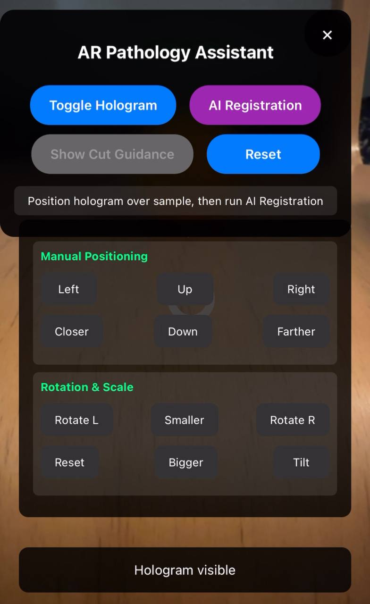

# AR Pathology Explorer

**Real-time AR guidance for pathology specimen grossing and surgical planning**

##  Project Description

The AR Pathology Assistant is an innovative web-based augmented reality application designed to revolutionize pathology specimen processing. It provides real-time visual guidance to pathology assistants during the critical "grossing" stage, where physical specimens (organs, tissues) are manually cut to prepare them for microscopic examination.

### The Problem
Pathology assistants often rely on CT scans and radiology images as references when cutting specimens, but translating 2D digital slices to 3D physical objects is:
- **Time-consuming** (10+ minutes of mental 3D mapping)
- **Error-prone** (missed diagnoses due to incorrect cuts)
- **Challenging for training** junior staff

### Our Solution
- **AI-powered registration** aligns digital models with physical specimens
- **AR visualization** shows optimal cutting planes directly on the specimen
- **Real-time guidance** for lesion sampling with safety margins
- **Web-based platform** accessible on any mobile device

## Key Features

- **Manual Hologram Positioning** - Intuitive touch controls for precise alignment
- **AI Registration System** - Automatic specimen recognition and orientation optimization
- **Cutting Plane Visualization** - Color-coded surgical guidance with safety margins
- **Lesion Targeting** - Optimal sampling angles for diagnostic accuracy
- **Mobile-First Design** - Works on smartphones and tablets
- **Real-Time AR** - No additional hardware required

## Technologies Used

### Frontend & AR
- **A-Frame 1.4.0** - WebXR framework for cross-platform AR
- **AR.js** - Marker-less AR tracking and camera integration
- **WebRTC** - Real-time camera access and processing
- **HTML5/CSS3** - Responsive UI with mobile optimization

### Development & Deployment
- **Vanilla JavaScript** - Core application logic and AR controls
- **Netlify Drop** - Instant deployment and hosting
- **Progressive Web App** - Offline capabilities and mobile installation

### Medical Integration Ready
- **DICOM Compatible** - Designed for medical imaging integration
- **CT Scan Processing** - Framework for radiology data alignment
- **3D Mesh Support** - Specimen shape analysis capabilities

## Demo Screenshots

### Manual Alignment Interface


*Touch controls for precise specimen alignment*
**

### AI Registration Process


*Simulated specimen recognition and optimization*
**

### Cutting Guidance Visualization


*AR overlay showing optimal cutting planes and safety margins with lesion targeting*

### Demo Video
[Watch Full AR Demo](./ar-pathology-explorer/assets/NOC_AR_Pathology_Demo.mp4)

## Use Cases

### Primary Workflow
1. **Specimen Placement** - Position tissue sample in camera view
2. **Manual Alignment** - Use touch controls to align digital twin
3. **AI Registration** - Automatic optimization and locking
4. **Cutting Guidance** - View optimal planes for lesion sampling

### Clinical Applications
- **Oncology** - Tumor margin assessment and sampling
- **Transplant Surgery** - Organ sectioning for evaluation
- **Forensic Pathology** - Evidence preservation and documentation
- **Training** - Educational tool for pathology residents

## Setup and Installation

### Prerequisites
- Modern web browser with WebRTC support (Chrome, Safari, Firefox)
- Mobile device with camera 


2. **Access Application**
   - [Open provided Netlify URL](https://animated-elf-12b594.netlify.app/)
   - Allow camera permissions when prompted
   - Begin AR experience


### File Structure
```
ar-pathology-assistant/
├── index.html              # Main application entry point
├── styles.css               # UI styling 
├── app.js                   # Core AR logic 
├── README.md                # Project documentation
└── assets/                  # Screenshots and demo materials
    ├── 
   
```

## Team Members

### **Lead Dev**
**Shaiyan Alam** - *Full-Stack Development*
- AR.js integration and WebXR implementation
- Mobile UI/UX design and responsive development
- AI registration algorithm simulation
- Medical workflow integration

### **Medical Consultant**
**Carla Felisha** - *Clinical Validation*
- Pathology workflow requirements analysis
- Medical terminology and accuracy validation
- Clinical use case development


## Future Roadmap

### Phase 1: Enhanced Detection
- Real-time specimen shape analysis
- Multiple organ type support
- Advanced AI registration algorithms

### Phase 2: Medical Integration
- DICOM file import and processing
- CT scan overlay capabilities
- Electronic health record integration

---

